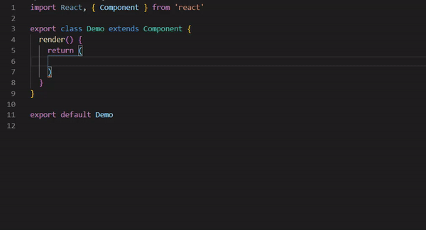

## React Vanilla Bootstrap v4 Components

This is an extension for Visual Studio Code that adds snippets for React Vanilla Bootstrap v4
### Usage

### Snippets list

You can find list of available snippets below:

| Snippet                         | Description                                |
| --------------------            | ------------------------------------------ |
| `rb-alert-header`               | Bootstrap Alert with Header                |
| `rb-alert`                      | Bootstrap Alert                            |
| `rb-badge-pill`                 | Bootstrap Badge Pill                       |
| `rb-badge`                      | Bootstrap Badge                            |
| `rb-breadcrumb`                 | Bootstrap Breadcrumb                       |
| `rb-btn-group-vertical`         | Bootstrap Button Group Vertical            |
| `rb-btn-group`                  | Bootstrap Button Group                     |
| `rb-btn-checkbox`               | Bootstrap Button Checkbox                  |
| `rb-btn-radio`                  | Bootstrap Button Radio                     |
| `rb-btn`                        | Bootstrap Button                           |
| `rb-card-columns`               | Bootstrap Card Columns                     |
| `rb-card-deck`                  | Bootstrap Card Deck                        |
| `rb-card-footer`                | Bootstrap Card Footer                      |
| `rb-card-full`                  | Bootstrap Card Full                        |
| `rb-card-group`                 | Bootstrap Card Group                       |
| `rb-card-header`                | Bootstrap Card Header                      |
| `rb-card-img-bottom`            | Bootstrap Card Image And Button            |
| `rb-card-img-full`              | Bootstrap Card Image Full                  |
| `rb-card-img-overlay`           | Bootstrap Card Image Overlay               |
| `rb-card-img-top`               | Bootstrap Card Image Top                   |
| `rb-card`                       | Bootstrap Card                             |
| `rb-carousel-controls`          | Bootstrap Carousel Controls                |
| `rb-carousel-full`              | Bootstrap Carousel Full                    |
| `rb-carousel-indicators`        | Bootstrap Carousel indicators              |
| `rb-carousel`                   | Bootstrap Carousel                         |
| `rb-collapse`                   | Bootstrap Collapse                         |
| `rb-dropdown-menu`              | Bootstrap Dropdown Menu                    |
| `rb-dropdown-split`             | Bootstrap Dropdown Split                   |
| `rb-dropdown`                   | Bootstrap Dropdown                         |
| `rb-form-check-inline`          | Bootstrap Form Check Inline                |
| `rb-form-check`                 | Bootstrap Form Check                       |
| `rb-form-custom-check-inline`   | Bootstrap Form Custom Check Inline         |
| `rb-form-custom-check`          | Bootstrap Form Custom Check                |
| `rb-form-custom-file`           | Bootstrap Form Custom File                 |
| `rb-form-custom-range`          | Bootstrap Form Custom Range                |
| `rb-form-custom-select-multiple`| Bootstrap Form Custom Select Multiple      |
| `rb-form-custom-select`         | Bootstrap Form Custom Select               |
| `rb-form-custom-switch`         | Bootstrap Form Custom Switch               |
| `rb-form-enctype-inline`        | Bootstrap Form Enctype Inline              |
| `rb-form-enctype`               | Bootstrap Form Enctype                     |
| `rb-form-file`                  | Bootstrap Form File                        |
| `rb-form-group`                 | Bootstrap Form Group                       |
| `rb-form-help`                  | Bootstrap Form Help                        |
| `rb-form-inline`                | Bootstrap Form Inline                      |
| `rb-form-invalid`               | Bootstrap Form Invalid                     |
| `rb-form-range`                 | Bootstrap Form Range                       |
| `rb-form-select-multiple`       | Bootstrap Form Select Multiple             |
| `rb-form-select`                | Bootstrap Form Select                      |
| `rb-form-textarea`              | Bootstrap Textarea                         |
| `rb-form-valid`                 | Bootstrap Form Valid                       |
| `rb-form`                       | Bootstrap Form                             |
| `rb-input-hidden-id`            | Input Hidden Id                            |
| `rb-input-hidden`               | Input Hidden                               |
| `rb-input-id`                   | Input Id                                   |
| `rb-input`                      | Input                                      |
| `rb-input-group-append`         | Input Group Append                         |
| `rb-input-group-full`           | Input Group Full                           |
| `rb-input-group-prepend`        | Input Group Prepend                        |
| `rb-jumbotron-fluid`            | Jumbotron Fluid                            |
| `rb-jumbotron`                  | Jumbotron                                  |
| `rb-list-group-action-flush`    | List Group Action Flush                    |
| `rb-list-group-action-horizontal`| List Group Action Flush                   |
| `rb-list-group-action`          | List Group Action                          |
| `rb-list-group-flush`           | List Group Flush                           |
| `rb-list-group-horizontal`      | List Group Horizontal                      |
| `rb-list-group`                 | List Group                                 |
| `rb-media-left`                 | Media Left                                 |
| `rb-media-right`                | Media Right                                |
| `rb-modal-center`               | Media Center                               |
| `rb-modal-footer-center`        | Model Footer Center                        |
| `rb-modal-footer`               | Model Footer                               |
| `rb-modal-full-center`          | Modal Full Center                          |
| `rb-modal-full`                 | Modal Full                                 |
| `rb-modal-header-center`        | Modal Header Center                        |
| `rb-modal-header`               | Modal Header                               |
| `rb-modal-toggle`               | Modal Toggle                               |
| `rb-modal`                      | Bootstrap Modal                            |
| `rb-navbar`                     | Bootstrap Navbar                           |
| `rb-nav-fill`                   | Bootstrap Fill Nav                         |
| `rb-nav-vertical`               | Bootstrap Vertical Nav                     |
| `rb-nav`                        | Bootstrap Nav                            |
| `rb-pagination`                 | Bootstrap Pagination                       |
| `rb-popover-title`              | Bootstrap Popover Title                    |
| `rb-popover`                    | Bootstrap Popover                          |
| `rb-progress-striped`           | Bootstrap Progress Striped                 |
| `rb-progress`                   | Bootstrap Progress                         |
| `rb-spinner-growing`            | Bootstrap Spinner Growing                  |
| `rb-spinner`                    | Bootstrap Spinner                          |
| `rb-toast`                      | Bootstrap Toast                            |
| `rb-figure`                     | Bootstrap Figure                           |
| `rb-img-fluid`                  | Bootstrap Fluid Image                      |
| `rb-img-thumbnail`              | Bootstrap Thumbnail Image                  |
| `rb-col`                        | Bootstrap Col                              |
| `rb-row`                        | Bootstrap Row                              |
| `rb-container-fluid`            | Bootstrap Fluid Container                  |
| `rb-container`                  | Bootstrap Container                        |
| `rb-table-footer`               | Bootstrap Table                            |
| `rb-table-full`                 | Bootstrap Table Full                       |
| `rb-table-header`               | Bootstrap Table Header                     |
| `rb-table`                      | Bootstrap Table                            |
| `rb-abbr-initialism`            | Abbr initialism                            |
| `rb-abbr`                       | Abbr Tag                                   |
| `rb-blockquote-footer`          | Blockquote Footer                          |
| `rb-blockquote`                 | Blockquote                                 |
| `rb-display`                    | Display-Header                             |
| `rb-list-inline`                | Inline List                                |
| `rb-list-unstyled`              | Unstyle List                               |
| `rb-clearfix`                   | Clearfix                                   |
| `rb-embed-responsive`           | Responsive Embed                           |
| `rb-flex-column-reverse`        | Flex Column Reverse                        |
| `rb-flex-column`                | Flex Column                                |
| `rb-flex-row-reverse`           | Flex row Reverse                           |
| `rb-flex-row`                   | Flex Row                                   |
| `rb-float-left`                 | Float Left                                 |
| `rb-float-right`                | Float Right                                |

### Contributing
Feel free to submit a pull request if you find any bugs (to see a list of active issues, visit the [Issues section](https://github.com/Zaczero/bootstrap-v4-snippets/issues)).
Please make sure all commits are properly documented.

### Contact

 Email: [jahidul.saeid@gmail.com](mailto:jahdiul.saeid@gmail.com)

### **Enjoy!**